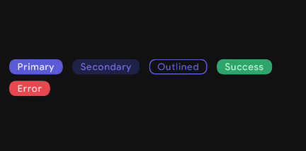
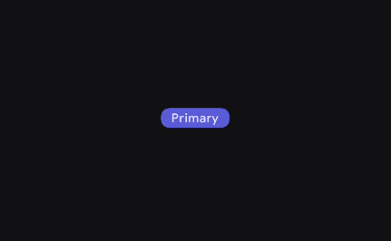

# Badge 

badge is a small,non-interactive visual indicator a lot number or label.


when to use 
- status or notification
- highlighting importance 
- error or success


when not to use 
- too much information
- critical actions

There are several types of buttons in Kore based on action importance (e.g., Primary, Secondary, Outlined, Ghost). Each button has a different level of emphasis, representing the intent and importance of the action.

<figure><figcaption></figcaption></figure>


For deeper reference, check out [Mobbin](https://mobbin.com/glossary/badge) guide on Badges.


## Primary Badge

The `PrimaryBadge` is a high-emphasis component used to draw immediate attention to important statuses or tags.

<figure><figcaption></figcaption></figure>


### Basic Example

| Slot | Description |
|------|-------------|
| `content` | The core element of the badge, typically a `Text` composable. |
| `leadingIcon` | An optional icon placed before the content. |
| `trailingIcon` | An optional icon placed after the content. |

```kotlin
PrimaryBadge(
    content = { Text("New Feature") }
)
```

## Styling

The badge exposes several parameters to customize its shape, size, icons, and colors.

### Parameters

| Parameter | Type | Default | Description |
|-----------|------|---------|-------------|
| `content` | `@Composable () -> Unit` | — | The main text or content to display inside the badge. |
| `modifier` | `Modifier` | `Modifier` | Applied to the root container of the badge. |
| `shape` | `Shape` | `KoreTheme.shapes.lg` | Defines the clipping shape of the badge container. |
| `badgeSizes` | `BadgeSizes` | `BadgeDefaults.defaultBadgeSize()`| Controls the internal padding and typography sizing of the badge. |
| `leadingIcon` | `@Composable (() -> Unit)?`| `null` | Optional icon rendered on the start side of the content. |
| `trailingIcon`| `@Composable (() -> Unit)?`| `null` | Optional icon rendered on the end side of the content. |
| `enabled` | `Boolean` | `true` | Controls the visual enabled state of the badge. |
| `badgeColors` | `BadgeColors` | `BadgeDefaults.primaryBadgeColors()`| The resolved colors used for the background and content. |

### With Icons

You can easily pass icons into the `leadingIcon` or `trailingIcon` slots to provide more context to the badge's text.

```kotlin
PrimaryBadge(
    leadingIcon = { 
        Icon(imageVector = PhIcons.Bold.Star, contentDescription = null) 
    },
    content = { Text("Premium") }
)
```

### Custom Shape and Colors

You can override the default shape to be perfectly round (useful for notification counts) or change the colors entirely.

<figure><figcaption></figcaption></figure>


```kotlin
PrimaryBadge(
    shape = RectangleShape,
    badgeColors = BadgeDefaults.primaryBadgeColors(
        containerColor = TailwindColors.Red500,
        contentColor = TailwindColors.Red50
    ),
    content = { Text("99+") }
)
```

## Other Variants

Kore provides three other Badge variants that follow the exact same anatomy as the `PrimaryBadge`, differing mostly in their default emphasis and colors.

<figure><figcaption></figcaption></figure>


### Secondary Badge
Used for medium-emphasis tags that need to be visible but shouldn't overpower the screen's primary elements. Ideal for general statuses.

```kotlin
SecondaryBadge(
    content = { Text("Processing") }
)
```

### Outlined Badge
Features a transparent background with a customizable `border`. Useful for subtle tags or alternative categories that need a clean, less heavy appearance.

<figure><figcaption></figcaption></figure>


```kotlin
OutlinedBadge(
    content = { Text("Archived") }
)
```
### Success Badge
A semantically colored badge (typically green) used to indicate a positive outcome, completion, or an active state.

<figure><figcaption></figcaption></figure>


```kotlin
SuccessBadge(
    leadingIcon = { 
        Icon(imageVector = PhIcons.Regular.Check, contentDescription = null) 
    },
    content = { Text("Approved") }
)
```

### Error Badge
A semantically colored badge (typically red) used to draw attention to failures, required actions, destructive states, or critical alerts.

<figure><figcaption></figcaption></figure>


```kotlin
ErrorBadge(
    leadingIcon = { 
        Icon(imageVector = PhIcons.Regular.Warning, contentDescription = null) 
    },
    content = { Text("Action Required") }
)
```


