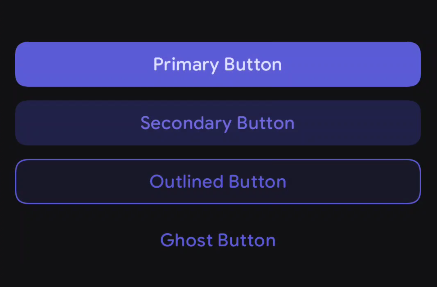
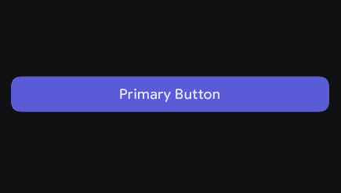
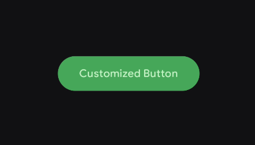
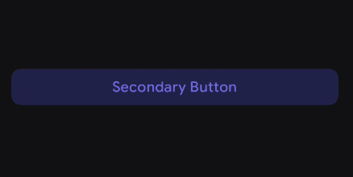
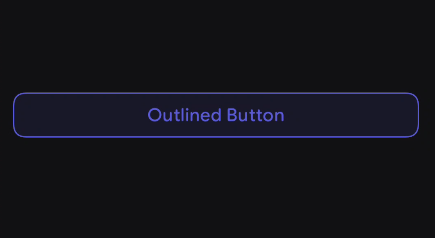
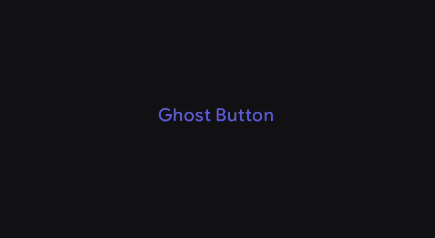

# Buttons

A **Button** is an interactive element that signals the user to take a specific action, such as making a purchase, submitting a form, or navigating to a new screen.

The button's content (label) expresses what action will occur when the user interacts with it. There are several types of buttons in Kore based on action importance (e.g., Primary, Secondary, Outlined, Ghost). Each button has a different level of emphasis, representing the intent and importance of the action.

<figure><figcaption></figcaption></figure>

For deeper reference, check out [Mobbin](https://mobbin.com/glossary/button) guide on Badges.

---

## Primary Button

The `PrimaryButton` is a highly prominent component used for the main action you want the user to take on a given screen.

<figure><figcaption></figcaption></figure>


### Basic Example

| Slot      | Description                                                             |
|-----------|-------------------------------------------------------------------------|
| `content` | Typically contains a `Text` composable, but can also include an `Icon`. |

```kotlin
PrimaryButton(
    onClick = { /* Handle click */ }
) {
    Text("Submit")
}
```

---

## Styling

The button exposes several parameters to customize its appearance and behavior.

### Parameters

| Parameter        | Type                              | Default                                 | Description                                                 |
|------------------|-----------------------------------|-----------------------------------------|-------------------------------------------------------------|
| `onClick`        | `() -> Unit`                      | —                                       | Called when the user clicks the button.                     |
| `modifier`       | `Modifier`                        | `Modifier`                              | Applied to the root container of the button.                |
| `enabled`        | `Boolean`                         | `true`                                  | Controls whether the button is interactive.                 |
| `contentPadding` | `PaddingValues`                   | `ButtonDefaults.defaultButtonPadding()` | Internal spacing between container and content.             |
| `colors`         | `ButtonColors`                    | `ButtonDefaults.primaryButtonColors()`  | Colors used for background and content in different states. |
| `shape`          | `Shape`                           | `ButtonDefaults.defaultButtonShape`     | Defines the button's shape (e.g., rounded corners).         |
| `content`        | `@Composable RowScope.() -> Unit` | —                                       | Content inside the button, arranged via `RowScope`.         |

---


## With Icon and Text

<figure><figcaption></figcaption></figure>


```kotlin
PrimaryButton(
    onClick = { /* Do something */ }
) {
    Icon(
        imageVector = PhIcons.Bold.Plus,
        contentDescription = null,
        modifier = Modifier.padding(end = 8.dp)
    )
    Text("Add New Item")
}
```

### Custom Shape Padding and Colors

You can override the default shape to be perfectly round or drastically change the padding and colors.

<figure><figcaption></figcaption></figure>


```kotlin
PrimaryButton(
    onClick = { /* Confirm action */ },
    shape = CircleShape,
    contentPadding = PaddingValues(horizontal = 32.dp, vertical = 16.dp),
    colors = ButtonDefaults.primaryButtonColors(
        containerColor = Color.Green,
        contentColor = Color.White
    )
) {
    Text("Confirm Everything")
}
```

---

## Other Variants

Kore provides three other Button variants that follow the exact same anatomy as the `PrimaryButton`, differing mostly in their default emphasis and colors.


## Secondary Button

Used for medium-emphasis actions that shouldn’t draw as much attention as the primary action. Ideal for alternative choices in a form or dialog.

<figure><figcaption></figcaption></figure>


```kotlin
SecondaryButton(
    onClick = { /* Save as draft */ }
) {
    Text("Save as Draft")
}
```

---

## Outlined Button

A medium-emphasis action with a visible border. Useful for secondary actions that still need clear affordance.

<figure><figcaption></figcaption></figure>


```kotlin
OutlinedButton(
    onClick = { /* Delete action */ },
) {
    Text("Delete Permanently")
}
```

---

## Ghost Button

A low-emphasis, transparent button used for less important or optional actions like “Cancel” or “Learn More”.

<figure><figcaption></figcaption></figure>


```kotlin
GhostButton(
    onClick = { /* Cancel action */ }
) {
    Text("Cancel")
}
```

---
