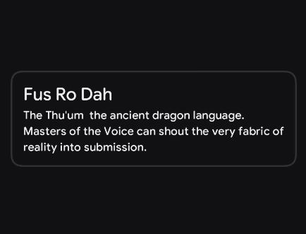

# Card 

A card is a container that groups related content and actions into a visually distinct unit.

When to use Card : 
- group related content
- interactive element
- collection or grids

When to avoid  Card :
- simple or minimal content
- large or complex layouts
- repetitive layouts


> For deeper reference, check out [Mobbin](https://mobbin.com/glossary/card) guide on Card.
## Basic Example

<figure><figcaption></figcaption></figure>


Because the `content` parameter provides a `ColumnScope`, any elements you place inside the Card will automatically stack vertically.

| Slot | Description |
|------|-------------|
| `content` | The core visual elements of the card. Arranged vertically by default. |

```kotlin
Card(
    modifier = Modifier.fillMaxWidth(),
    contentPaddingValues = PaddingValues(KoreTheme.sizes.md)
) {
    Text(
        text = "The Elder Scrolls V: Skyrim",
        color = KoreTheme.colorScheme.onBackground,
        textStyle = KoreTheme.typography.title1
    )

    Spacer(modifier = Modifier.height(KoreTheme.sizes.sm))

    Text(
        text = "A dragon has returned to the ancient land of Skyrim. You are the Dragonborn  the only one who can absorb their souls and stop the apocalypse. Your legend begins now.",
        textStyle = KoreTheme.typography.body2
    )
}

```

## Styling

The Card exposes several parameters to customize its elevation, shape, internal padding, and colors to fit different hierarchy needs.

### Parameters

| Parameter | Type | Default | Description |
|-----------|------|---------|-------------|
| `modifier` | `Modifier` | `Modifier` | Applied to the root container of the card. |
| `shape` | `Shape` | `CardDefaults.defaultCardShape` | Defines the clipping shape of the card (typically rounded corners). |
| `containerColor` | `Color` | `CardDefaults.defaultCardContainerColor` | The background color of the card container. |
| `contentColor` | `Color` | `CardDefaults.defaultCardContentColor` | The default color applied to content inside the card. |
| `elevation` | `Dp` | `CardDefaults.defaultCardElevation` | Controls the shadow cast by the card to communicate depth. |
| `contentAlignment` | `Alignment` | `Alignment.TopStart` | The vertical and horizontal alignment of content inside the card. |
| `contentPaddingValues` | `PaddingValues` | `CardDefaults.defaultCardContentPaddingValues` | The spacing applied internally between the card boundaries and the content. |
| `content` | `@Composable ColumnScope.() -> Unit` | — | The main content. Elements placed here are arranged vertically. |

## Outlined Card

If your screen is already complex and elevated shadows would create too much visual noise, use an `OutlinedCard`. This variant drops the heavy shadow and relies on a clean, customizable border stroke to define its boundaries.

### Basic Example

<figure><figcaption></figcaption></figure>


```kotlin
OutlinedCard(
    modifier = Modifier.fillMaxWidth(),
    contentPaddingValues = PaddingValues(KoreTheme.sizes.md)
) {
    Text(
        text = "Fus Ro Dah",
        color = KoreTheme.colorScheme.onBackground,
        textStyle = KoreTheme.typography.title1
    )

    Spacer(modifier = Modifier.height(KoreTheme.sizes.xxs))

    Text(
        text = "The Thu'um — the ancient dragon language. Masters of the Voice can shout the very fabric of reality into submission.",
        textStyle = KoreTheme.typography.body2
    )
}
```

### Parameters

The `OutlinedCard` shares the same anatomy as the standard `Card`, but introduces a `borderStroke` parameter and uses a different default color scheme.

| Parameter | Type | Default | Description |
|-----------|------|---------|-------------|
| `modifier` | `Modifier` | `Modifier` | Applied to the root container of the card. |
| `shape` | `Shape` | `CardDefaults.defaultCardShape` | Defines the clipping shape of the card. |
| `containerColor` | `Color` | `CardDefaults.defaultOutlinedContainerColor` | The background color of the outlined card container. |
| `contentColor` | `Color` | `CardDefaults.defaultOutlinedContentColor` | The default color applied to content inside the card. |
| `borderStroke` | `BorderStroke` | `CardDefaults.defaultOutlinedBorderStroke` | The stroke drawn around the perimeter of the card container. |
| `elevation` | `Dp` | `CardDefaults.defaultCardElevation` | Controls shadow. Usually left at 0.dp for outlined variants. |
| `contentAlignment` | `Alignment` | `Alignment.TopStart` | The vertical and horizontal alignment of content inside the card. |
| `contentPaddingValues` | `PaddingValues` | `CardDefaults.defaultCardContentPaddingValues` | The spacing applied internally. |
| `content` | `@Composable ColumnScope.() -> Unit` | — | The main content. |

### Custom Border

You can easily override the `borderStroke` to emphasize the card, indicate a selection state, or match a specific brand color.

```kotlin
OutlinedCard(
    borderStroke = BorderStroke(width = 2.dp, color = KoreTheme.colorScheme.primary),
    modifier = Modifier.fillMaxWidth()
) {
    Text("Selected Item", style = KoreTheme.typography.display1, color = KoreTheme.colorScheme.primary)
    Text("The thicker, colored border indicates this card is currently selected.")
}
```