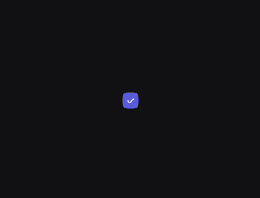
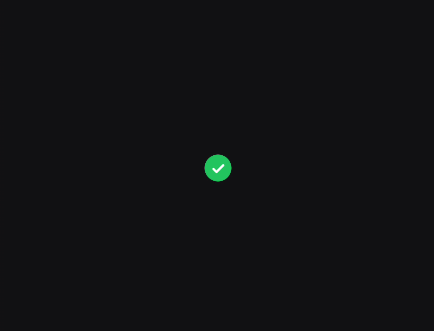

# Checkbox

A Checkbox is an input control that allows users to select one or more options from a set. They are typically used in forms, settings panels, and lists where multiple selections are permitted.

When to use Checkboxes :
- Selecting multiple items from a list (e.g., filtering search results)
- Toggling a specific setting on or off
- Acknowledging agreements (e.g., "Accept Terms and Conditions")

When not to avoid Checkboxes:
- When the user must select exactly *one* option from a mutually exclusive list (use a `RadioButton` instead)
- For immediate actions that take effect the moment they are toggled (a `Switch` is often better for instant system-level changes)

For deeper reference, check out [Mobbin](https://mobbin.com/glossary/checkbox) guide on CheckBox.


## Basic Example

Because a Checkbox is stateless by default, you must pass in its current `checked` state and a callback to update that state when interacted with.

<figure><figcaption></figcaption></figure>


```kotlin
var isChecked by remember { mutableStateOf(false) }

CheckBox(
    checked = isChecked,
    onCheckChange = { isChecked = it }
)
```

## Styling

The Checkbox exposes parameters to customize its shape, border thickness, and colors for various states.

### Parameters

| Parameter           | Type                        | Default                                       | Description                                                                      |
|---------------------|-----------------------------|-----------------------------------------------|----------------------------------------------------------------------------------|
| `modifier`          | `Modifier`                  | `Modifier`                                    | Applied to the root container of the Checkbox.                                   |
| `checked`           | `Boolean`                   | —                                             | The current checked state of the Checkbox.                                       |
| `onCheckChange`     | `(Boolean) -> Unit`         | —                                             | Callback invoked when the Checkbox is checked or unchecked.                      |
| `enabled`           | `Boolean`                   | `true`                                        | Controls the interactive and visual enabled state of the Checkbox.               |
| `shape`             | `Shape`                     | `CheckBoxDefaults.defaultCheckBoxShape`       | Defines the clipping shape of the Checkbox (typically slightly rounded corners). |
| `borderWidth`       | `Dp`                        | `CheckBoxDefaults.defaultCheckBoxBorderWidth` | The thickness of the border when the checkbox is unchecked.                      |
| `colors`            | `CheckBoxColors`            | `CheckBoxDefaults.defaultCheckBoxColors()`    | The resolved colors used for the box and checkmark in different states.          |
| `interactionSource` | `MutableInteractionSource?` | `null`                                        | Represents the stream of interactions (e.g., pressed, focused).                  |

### Checkbox with a Label

A Checkbox component does not include text by itself. To create a labeled checkbox, wrap it in a `Row` alongside a `Text` composable. You can also make the entire row clickable for a better user experience.

<figure><figcaption></figcaption></figure>


```kotlin
var isChecked by remember { mutableStateOf(false) }

Row(
    verticalAlignment = Alignment.CenterVertically,
    modifier = Modifier
        .clip(KoreTheme.shapes.sm)
        .clickable { isChecked = !isChecked }
        .padding(8.dp)
) {
    CheckBox(
        checked = isChecked,
        onCheckChange = { isChecked = it }
    )
    Spacer(modifier = Modifier.width(12.dp))
    Text("Subscribe to newsletter")
}
```

### Custom Shape and Colors

You can easily override the default styling to change the border thickness, make the checkbox perfectly round, or apply specific brand colors.

<figure><figcaption></figcaption></figure>


```kotlin
var isChecked by remember { mutableStateOf(true) }

CheckBox(
    checked = isChecked,
    onCheckChange = { isChecked = it },
    shape = CircleShape,
    borderWidth = 2.dp,
    colors = CheckBoxDefaults.defaultCheckBoxColors(
        checkedContainerColor = TailwindColors.Green500,
        checkedCheckColor = TailwindColors.White,
        uncheckedBorderColor = TailwindColors.Gray500
    )
)
```