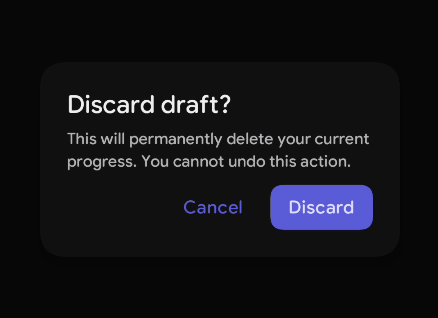
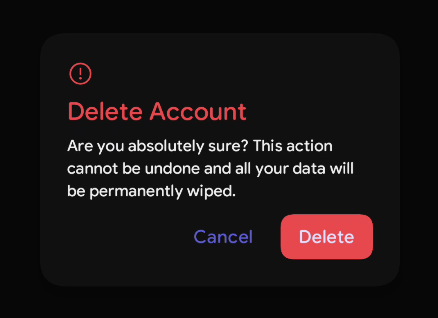

# Alert Dialog

An Alert Dialog is a modal popup that overlays the main content to interrupt the user's workflow. It is used to communicate critical information or ask for a necessary decision before the user can proceed. 

When to use Alert Dialog:
- Destructive actions (e.g., deleting a file, permanently clearing data).
- Critical system-level errors or urgent alerts.
- When you require explicit user confirmation before proceeding with a task.

When to avoid Alert Dialog:
- Non-critical information that doesn't require immediate user action (use Snackbars or Toasts instead).
- Complex data entry, long forms, or deep configurations (use a Full-screen Dialog or Bottom Sheet).
- Repetitive, low-risk actions (avoids "dialog fatigue").

For deeper reference, check out [Material Design](https://m3.material.io/components/dialogs/overview) guidelines on dialogs.


| Slot              | Description                                                                      |
|-------------------|----------------------------------------------------------------------------------|
| `*title`           | The title of the Dialog, usually a concise heading conveying the alert message.  |
| `icon`            | An optional icon displayed above the title to visually represent the intent.     |
| `description`     | The supporting text explaining the details or consequences of the alert.         |
| `*confirmButton`   | The primary action you want the user to execute (e.g., "OK", "Delete", "Save").  |
| `dismissButton`   | The secondary action to cancel or back out (e.g., "Cancel", "No").               |

## Basic Example

<figure><figcaption></figcaption></figure>
To use an `AlertDialog`, you must hoist a boolean state to control its visibility.


``` kotlin
var showDialog by remember { mutableStateOf(false) }

PrimaryButton(onClick = { showDialog = true }) {
    Text("Discard Draft")
}

if (showDialog) {
    AlertDialog(
        onDismissRequest = { showDialog = false },
        title = { Text("Discard draft?") },
        description = { Text("This will permanently delete your current progress. You cannot undo this action.") },
        confirmButton = {
            PrimaryButton(onClick = { /* Handle discard logic */ showDialog = false }) {
                Text("Discard")
            }
        },
        dismissButton = {
            GhostButton(onClick = { showDialog = false }) {
                Text("Cancel")
            }
        }
    )
}
```

## Styling
AlertDialog exposes extensive parameters to customize its spacing, elevation, arrangement, and colors.

### Parameters

| Parameter                 | Type                             | Default                                       | Description                                                                 |
|---------------------------|----------------------------------|-----------------------------------------------|-----------------------------------------------------------------------------|
| `onDismissRequest`        | `() -> Unit`                     | —                                             | Callback triggered when dismissing the dialog (clicking outside/back).      |
| `modifier`                | `Modifier`                       | `Modifier`                                    | Applied to the dialog container `Box`.                                      |
| `dialogShape`             | `Shape`                          | `DialogDefaults.defaultDialogShape`           | The geometric shape of the dialog container (defaults to large rounded).    |
| `dialogColors`            | `DialogColors`                   | `DialogDefaults.alertDialogColors()`          | The colors applied to the container, title, description, and borders.       |
| `border`                  | `BorderStroke?`                  | `null`                                        | Optional border stroke around the dialog container.                         |
| `elevation`               | `Dp`                             | `DialogDefaults.defaultDialogElevation`       | The shadow elevation applied to the dialog window.                          |
| `dialogActionArrangement` | `Arrangement.Horizontal`         | `DialogDefaults.defaultActionArrangement`     | Alignment of the action buttons (defaults to end/right aligned).            |
| `dialogProperties`        | `DialogProperties`               | `DialogDefaults.defaultDialogProperties`      | System properties configuring platform-specific dialog behavior.            |
| `dialogSpacing`           | `DialogSpacing`                  | `DialogDefaults.defaultDialogSpacing()`       | Configures the vertical gaps between the icon, title, description & buttons.|
| `contentPadding`          | `PaddingValues`                  | `DialogDefaults.defaultDialogPaddingValues`   | Padding applied inside the dialog container around all content.             |

### Destructive Alert with Icon

For high-risk actions, it is common to include a warning icon and override the default text colors to indicate a destructive intent (like red/error colors).

<figure><figcaption></figcaption></figure>

```kotlin
AlertDialog(
    onDismissRequest = { showDialog = false },
    icon = { 
        Icon(
            imageVector = PhIcons.Regular.WarningCircle, 
            contentDescription = "Warning",
            tint = KoreTheme.colorScheme.error
        ) 
    },
    title = { Text("Delete Account") },
    description = { 
        Text("Are you absolutely sure? This action cannot be undone and all your data will be permanently wiped.") 
    },
    dialogColors = DialogDefaults.alertDialogColors(
        titleTextColors = KoreTheme.colorScheme.error, // Highlight title in red
        descriptionTextColor = KoreTheme.colorScheme.onBackGround
    ),
    confirmButton = {
        PrimaryButton(
            onClick = { /* Delete Account */ },
            colors = ButtonDefaults.primaryButtonColors(containerColor = KoreTheme.colorScheme.error)
        ) {
            Text("Delete Permanently")
        }
    },
    dismissButton = {
        GhostButton(onClick = { showDialog = false }) {
            Text("Cancel")
        }
    }
)
```