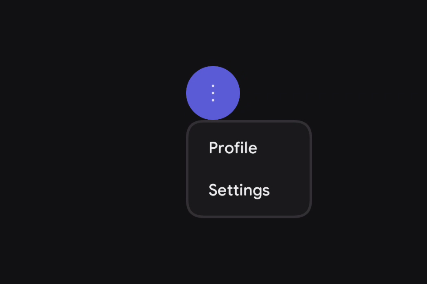
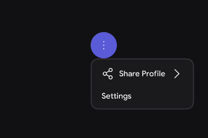
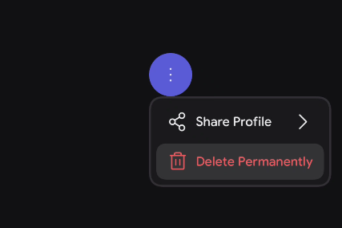

# DropDown

A dropdown menu presents a list of actions, options, or links in a temporary surface. They provide navigation options and access to various features and functionalities of the app.


when to use DropDown :
- Multiple options with limited 
- Secondary Actions 

when to avoid DropDown :
- For primary app routing/navigation (use an `Appbar` or `Navigation Bar` instead.)
- Frequently accessed actions 

> For deeper reference check out [Mobbin](https://mobbin.com/glossary/dropdown-menu) guide on Dropdown


## Basic Example 

Dropdowns typically require a state variable to control their expanded/collapsed state, and are often anchored to an icon or button that triggers them. 


| Slot | Description |
|------|-------------|
| `content` | The internal elements of the menu, typically a vertical list of items. It provides a `ColumnScope`. |


Because the `DropDown` provides a `ColumnScope`, any elements you place inside it will automatically stack vertically.

<figure><figcaption></figcaption></figure>


```kotlin
var expanded by remember { mutableStateOf(false) }

Box {
    // Anchor element that triggers the dropdown
    PrimaryIconButton(onClick = { expanded = true }) {
        Icon(imageVector = PhIcons.Bold.DotsThreeVertical, contentDescription = "More options")
    }

    // The Dropdown container 
    DropDown(
        expanded = expanded,
        onDismissRequest = { expanded = false }
    ) {
        DropDownItem(
            title = { Text("Profile") },
            onClick = { expanded = false /* do something */}
        )
        DropDownItem(
            title = { Text("Settings") },
            onClick = { expanded = false /*idk what to do */}
        )
    }
}
```
## Styling

The DropDown exposes several parameters to customize its border, shape, internal padding, and animationspec to fit different hierarchy needs.

### Parameters

| Parameter | Type | Default | Description |
|-----------|------|---------|-------------|
| `expanded` | `Boolean` | — | Controls whether the dropdown menu is currently visible. |
| `onDismissRequest` | `() -> Unit` | — | Called when the user clicks outside the menu or presses the back button. |
| `modifier` | `Modifier` | `Modifier` | Applied to the root container of the dropdown menu. |
| `offset` | `DpOffset` | `DpOffset.Zero` | Adjusts the physical positioning of the menu relative to its anchor point. |
| `shape` | `Shape` | `DropdownDefaults.defaultDropDownShape` | Defines the clipping shape of the dropdown container. |
| `scrollState` | `ScrollState` | `rememberScrollState()` | Controls the scrolling behavior if the list of items exceeds the screen height. |
| `borderStroke` | `BorderStroke?` | `BorderStroke(...)` | An optional stroke drawn around the perimeter of the dropdown menu. |
| `containerColor`| `Color` | `DropdownDefaults.defaultContainerColor` | The background color of the dropdown surface. |
| `itemSpacing` | `Dp` | `DropdownDefaults.defaultDropDownItemSpacing` | The vertical spacing applied between each item inside the menu. |
| `contentPaddingValues`| `PaddingValues`| `DropdownDefaults.defaultDropDownContainerPaddingValues`| The internal padding between the menu boundaries and the content items. |
| `animationSpec` | `DropDownAnimationSpec` | `DropdownDefaults...()` | The animation configuration used when the dropdown enters and exits. |
| `content` | `@Composable ColumnScope.() -> Unit`| — | The items to display inside the menu. |

---

## Dropdown Item

A `DropDownItem` represents a single actionable choice or destination within a `DropDown` menu. It provides a consistent layout for text, optional leading and trailing icons, and handles interactive states like hover, focus, and clicks.

### Parameters

| Parameter | Type | Default | Description |
|-----------|------|---------|-------------|
| `modifier` | `Modifier` | `Modifier` | Applied to the root container of the item. |
| `title` | `@Composable () -> Unit` | — | The primary text or component of the menu item. |
| `onClick` | `() -> Unit` | — | Called when the user clicks the item. |
| `leading` | `@Composable (() -> Unit)?` | `null` | Optional icon or content rendered on the start side. |
| `trailing` | `@Composable (() -> Unit)?` | `null` | Optional icon or content rendered on the end side. |
| `enabled` | `Boolean` | `true` | Controls the interactive and visual enabled state. |
| `shape` | `Shape` | `KoreTheme.shapes.sm` | Defines the clipping shape of the item's background (useful for hover states). |
| `colors` | `DropDownItemColors` | `DropdownDefaults.defaultDropDownItemColors()`| The resolved colors used for the background and content in various states. |
| `paddingValues` | `DropDownMenuItemPaddingValues` | `DropdownDefaults...()` | The internal padding applied to the item's content. |
| `interactionSource`| `MutableInteractionSource?`| `null` | Represents the stream of interactions (e.g., pressed, hovered). |

### With Leading and Trailing Icons

You can easily provide more context to your actions by utilizing the `leading` and `trailing` slots.

<figure><figcaption></figcaption></figure>

```kotlin
DropDownItem(
    title = { Text("Share Profile") },
    leading = { 
        Icon(imageVector = PhIcons.Regular.ShareNetwork, contentDescription = null) 
    },
    trailing = { 
        Icon(imageVector = PhIcons.Regular.CaretRight, contentDescription = null) 
    },
    onClick = { /* Open share sheet */ }
)
```

### Destructive Action (Custom Colors)

You can override the default colors to indicate destructive actions, like deleting an item or logging out.

<figure><figcaption></figcaption></figure>

```kotlin
DropDownItem(
    title = { Text("Delete Permanently") },
    leading = { 
        Icon(imageVector = PhIcons.Regular.Trash, contentDescription = null) 
    },
    colors = DropdownDefaults.defaultDropDownItemColors(
        contentColor = KoreTheme.colorScheme.error,
        leadingContentColor = KoreTheme.colorScheme.error
    ),
    onClick = { /* Handle deletion */ }
)
```
