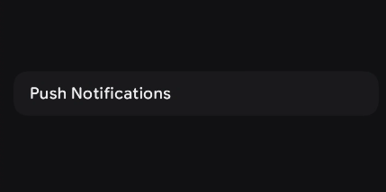
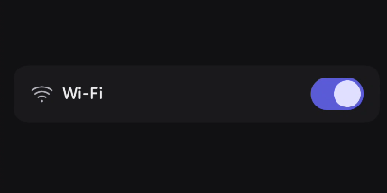
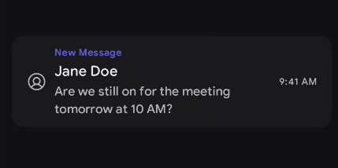

# ListTile 
A list tile is a single row in a list that shows one piece of information or one option.

It usually includes a labels (text) and sometimes an icon or action, and all items look similar so they’re easy to scan and use.

when to use ListTile
- orderered information
- concise information 
- scannable single column layout 

when to avoid ListTile 
- Complex data
- Content heavy 

for deeper reference check out [Mobbin]("https://mobbin.com/glossary/stacked-list") guide on ListTile

## Basic Example 

By default, a `ListTile` only strictly requires a `title`. If you provide an `onClick` parameter, the entire tile automatically becomes interactive and displays standard ripple effects.

| Slot | Description |
|------|-------------|
| `title` | The primary text identifying the list item. |

<figure><figcaption></figcaption></figure>

```kotlin
ListTile(
    title = { Text("Push Notifications") },
    onClick = { /* Navigate to notification settings */ }
)
```

## Styling 

The List Tile exposes a rich set of slots (leading, trailing, overline, subtitle) and formatting parameters to handle everything from simple one-line items to complex three-line interactive rows.

### Parameters

| Parameter | Type | Default | Description |
|-----------|------|---------|-------------|
| `title` | `@Composable () -> Unit` | — | The primary text or content of the list item. |
| `modifier` | `Modifier` | `Modifier` | Applied to the root container of the list tile. |
| `onClick` | `(() -> Unit)?` | `null` | Called when clicked. If null, the tile is non-interactive. |
| `leading` | `@Composable (() -> Unit)?` | `null` | Content (often an icon/avatar) placed before the title. |
| `leadingAlignment`| `Alignment.Vertical` | `ListTileDefaults.defaultLeadingAlignment`| Vertical alignment of the leading content. |
| `overline` | `@Composable (() -> Unit)?` | `null` | Small text appearing directly *above* the title. |
| `subtitle` | `@Composable (() -> Unit)?` | `null` | Supporting text appearing directly *below* the title. |
| `trailing` | `@Composable (() -> Unit)?` | `null` | Content (often a switch or icon) placed after the title. |
| `trailingAlignment`| `Alignment.Vertical` | `ListTileDefaults.defaultTrailingAlignment`| Vertical alignment of the trailing content. |
| `shape` | `Shape` | `ListTileDefaults.defaultListTileShape` | Defines the clipping shape of the list tile's background. |
| `colors` | `ListTileColors` | `ListTileDefaults.defaultListTileColors()`| The resolved colors used for the background and text slots. |
| `contentPaddingValues`| `PaddingValues`| `ListTileDefaults.defaultListItemPaddingValues`| Internal padding separating the content from the container edges. |

### Leading & Trailing Actions

You can easily pair text with controls. A very common pattern is placing an identifying icon in the `leading` slot and an interactive element (like a Checkbox or Switch) in the `trailing` slot.

<figure><figcaption></figcaption></figure>


```kotlin
var isWifiEnabled by remember { mutableStateOf(true) }

ListTile(
    leading = { 
        Icon(imageVector = PhIcons.Regular.WifiHigh, contentDescription = null) 
    },
    title = { Text("Wi-Fi") },
    trailing = {
        Switch( // Assuming you have a Switch component
            checked = isWifiEnabled,
            onCheckChange = { isWifiEnabled = it }
        )
    },
    onClick = { isWifiEnabled = !isWifiEnabled } // Allows tapping the whole row
)
```

### Complex / Multi-line Tile

For denser data requirements, you can utilize the `overline` and `subtitle` slots to create a structured three-line list item. This is heavily used in email clients or detailed contact lists.

<figure><figcaption></figcaption></figure>


```kotlin
ListTile(
    overline = { Text("New Message", color = KoreTheme.colorScheme.primary) },
    title = { Text("Jane Doe") },
    subtitle = { Text("Are we still on for the meeting tomorrow at 10 AM?") },
    leading = { 
        Icon(imageVector = PhIcons.Regular.UserCircle, contentDescription = "Profile") 
    },
    trailing = { 
        Text("9:41 AM", style = KoreTheme.typography.label3) 
    },
    onClick = { /* Open message thread */ }
)
```


