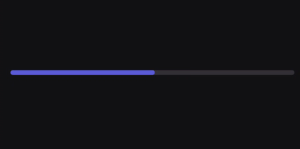
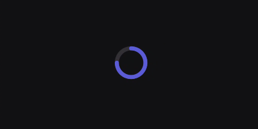
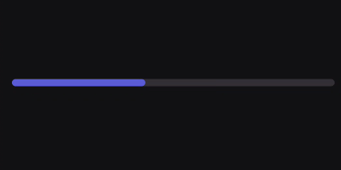
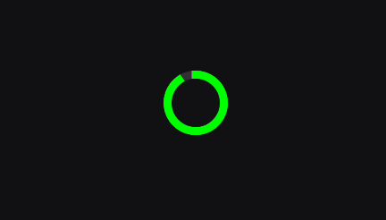

# Progress Indicators

A Progress Indicator is a visual representation of a determinate task. Unlike a loading indicator (which spins indefinitely), a progress indicator fills up to show exactly how much of a task has been completed and how much is left.

When to use Progress Indicators :
- Displaying the status of file downloads or uploads.
- Showing a user's progression through a multistep form or onboarding flow.
- Tracking metrics or goals (e.g., "75% of daily calories consumed").

When not to avoid Progress Indicators:
- For tasks where you do not know the total duration or wait time (use an indeterminate `LoadingIndicator` instead).
- For instant, synchronous actions.

for deeper reference check out [Mobbin](https://mobbin.com/glossary/progress-indicator) guide on ListTile

---

## Linear Progress Indicator

The `LinearProgressIndicator` uses a horizontal bar that fills from left to right as the task advances. By default, it spans the maximum width of its parent container.

### Basic Example 

By default, the indicator expects a `progress` value between `0f` and `100f`.

<figure><figcaption></figcaption></figure>


```kotlin
var currentProgress by remember { mutableStateOf(50f) } // 50% complete

LinearProgressIndicator(
    progress = currentProgress
)
```

### Parameters

| Parameter | Type | Default | Description |
|-----------|------|---------|-------------|
| `progress` | `Float` | — | The current progress of the task. |
| `valueRange` | `ClosedFloatingPointRange<Float>` | `0f..100f` | The range of values that `progress` can take. The indicator automatically calculates the fill fraction based on this range. |
| `modifier` | `Modifier` | `Modifier` | Applied to the root canvas of the indicator. |
| `thickness` | `Dp` | `ProgressIndicatorDefaults.defaultProgressBarThickness` | The vertical height/thickness of the progress line. |
| `cap` | `StrokeCap` | `ProgressIndicatorDefaults.defaultProgressBarCap` | The visual shape at the ends of the progress line (defaults to `Round`). |
| `colors` | `ProgressIndicatorColors` | `ProgressIndicatorDefaults.barProgressColors()` | The colors used for the filled progress and the empty background track. |

---

## Circular Progress Indicator

The `CircularProgressIndicator` uses a circular ring that fills up clockwise. It is ideal for compact spaces, metric dashboards, or inline list items.

### Basic Example

<figure><figcaption></figcaption></figure>

```kotlin
var currentProgress by remember { mutableStateOf(75f) } // 75% complete

CircularProgressIndicator(
    progress = currentProgress
)
```

### Parameters

| Parameter | Type | Default | Description |
|-----------|------|---------|-------------|
| `progress` | `Float` | — | The current progress of the task. |
| `valueRange` | `ClosedFloatingPointRange<Float>` | `0f..100f` | The range of values that `progress` can take. |
| `modifier` | `Modifier` | `Modifier` | Applied to the root canvas of the indicator. |
| `thickness` | `Dp` | `ProgressIndicatorDefaults.defaultCircularBarThickness` | The thickness of the stroke itself. |
| `size` | `Dp` | `ProgressIndicatorDefaults.defaultCircularProgressBarSize`| The overall width and height of the circular ring. |
| `cap` | `StrokeCap` | `ProgressIndicatorDefaults.defaultProgressBarCap` | The visual shape at the ends of the circular stroke. |
| `colors` | `ProgressIndicatorColors` | `ProgressIndicatorDefaults.circularProgressColors()` | The colors used for the filled progress arc and the background track. |

---

## Customization

### Custom Value Ranges
Because the API supports a `valueRange`, you don't have to manually calculate percentages. If you have a 5-step form, you can simply pass the current step and set the range to `0f..5f`.

<figure><figcaption></figcaption></figure>

```kotlin
var currentStep by remember { mutableStateOf(2f) } 

LinearProgressIndicator(
    progress = currentStep,
    valueRange = 0f..5f, // Automatically calculates this as 40% complete
    thickness = 8.dp
)
```

### Custom Styling
You can heavily customize both indicators to match specific brand aesthetics or to indicate states by overriding their default colors, thickness, and caps.

<figure><figcaption></figcaption></figure>

```kotlin
CircularProgressIndicator(
    progress = 90f,
    size = 64.dp,
    thickness = 8.dp,
    cap = StrokeCap.Square, // Flat, non-rounded edges
    colors = ProgressIndicatorDefaults.circularProgressColors(
        trackColor = KoreTheme.colorScheme.backGroundVariant,
        progressColor = Color.Green // Indicate completion
    )
)
```