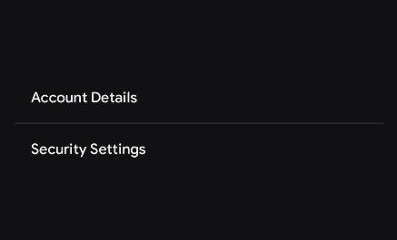
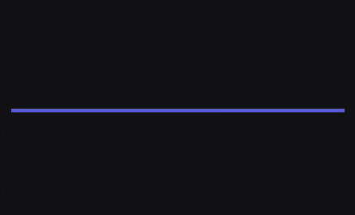

# Separators

A Separator (often called a Divider) is a thin, structural line used to group related content or create clear visual distinctions between different sections of a layout. 

You can use Separators for:
- Dividing individual items within a continuous list or menu.
- Separating distinct structural sections of a screen (e.g., separating a header from the main content).
- Creating visual breaks in tightly packed data structures.

When not to use Separators:
- If standard whitespace, padding, or elevation is enough to establish a clear visual hierarchy (overusing separators can create unnecessary visual noise).


---

## Horizontal Separator

The `HorizontalSeparator` draws a line from left to right. By default, it fills the maximum width of its parent container.

### Basic Example 

<figure><figcaption></figcaption></figure>

```kotlin
Column(modifier = Modifier.fillMaxWidth()) {
    Text("Account Details", modifier = Modifier.padding(16.dp))
    
    // Default 1.dp horizontal line
    HorizontalSeparator()
    
    Text("Security Settings", modifier = Modifier.padding(16.dp))
}
```

### Parameters

Both the solid color and gradient brush overloads share these base parameters:

| Parameter | Type | Default | Description |
|-----------|------|---------|-------------|
| `modifier` | `Modifier` | `Modifier` | Applied to the root canvas of the separator. |
| `thickness` | `Dp` | `SeparatorDefaults.defaultSeparatorThickness` | The height/thickness of the horizontal line. |
| `separatorCap` | `StrokeCap` | `SeparatorDefaults.defaultSeparatorCap` | The visual treatment at the ends of the line (defaults to `Round`). |
| `color` | `Color` | `SeparatorDefaults.defaultSeparatorColor` | The solid color of the separator. |
| `brush` | `Brush` | — | *(Overload)* A gradient brush used instead of a solid color. |

---

## Vertical Separator

The `VerticalSeparator` draws a line from top to bottom. By default, it attempts to fill the maximum height of its parent container. 

*Tip: For `fillMaxHeight()` to work correctly, the parent `Row` must have a defined height. A common approach is setting the parent to `Modifier.height(IntrinsicSize.Min)`.*

### Basic Example

<figure><figcaption></figcaption></figure>

```kotlin
Row(
    modifier = Modifier
        .fillMaxWidth()
        .height(IntrinsicSize.Min)
        .padding(vertical = 8.dp),
    verticalAlignment = Alignment.CenterVertically,
    horizontalArrangement = Arrangement.SpaceEvenly
) {
    GhostButton(onClick = { /* ... */ }) { 
        Text("Like") 
    }

    VerticalSeparator(
        modifier = Modifier.padding(vertical = 8.dp)
    )

    GhostButton(onClick = { /* ... */ }) { 
        Text("Comment") 
    }

    VerticalSeparator(
        modifier = Modifier.padding(vertical = 8.dp)
    )

    GhostButton(onClick = { /* ... */ }) { 
        Text("Share") 
    }
}
```

### Parameters

| Parameter | Type | Default | Description |
|-----------|------|---------|-------------|
| `modifier` | `Modifier` | `Modifier` | Applied to the root canvas of the separator. |
| `thickness` | `Dp` | `SeparatorDefaults.defaultSeparatorThickness` | The width/thickness of the vertical line. |
| `separatorCap` | `StrokeCap` | `SeparatorDefaults.defaultSeparatorCap` | The visual treatment at the ends of the line. |
| `color` | `Color` | `SeparatorDefaults.defaultSeparatorColor` | The solid color of the separator. |
| `brush` | `Brush` | — | *(Overload)* A gradient brush used instead of a solid color. |

---

## Customization

Your API allows for deep customization, including changing the line endings (`StrokeCap`) and applying rich gradients using Compose's `Brush` API.

### Thick, Custom Colored Line

<figure><figcaption></figcaption></figure>

```kotlin
HorizontalSeparator(
    thickness = 4.dp,
    separatorCap = StrokeCap.Square,
    color = KoreTheme.colorScheme.primary
)
```

### Gradient Separator

Using the overloaded API, you can pass a `Brush` to create smooth, fading transitions. This is excellent for creating elegant, modern dividers that fade out at the edges.

<figure><figcaption></figcaption></figure>

```kotlin
HorizontalSeparator(
    thickness = 2.dp,
    brush = Brush.horizontalGradient(
        colors = listOf(
            Color.Transparent,
            KoreTheme.colorScheme.primary,
            Color.Transparent
        )
    )
)
```