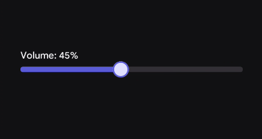
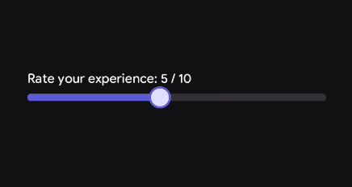
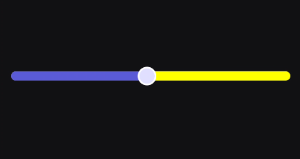

# Slider

A Slider is an interactive control that allows users to make selections from a continuous range of values along a horizontal track.

You can use Sliders for:
- Adjusting system settings that don't require specific values (e.g., volume, brightness, or screen sleep time).
- Applying visual adjustments (e.g., image filters, brush size in a drawing app).
- Navigating through media (e.g., a video or audio playback timeline).

When not to use Sliders:
- When the user needs to input an exact, highly precise numerical value (use a numeric `TextField` instead).
- When the selection is binary or a small set of distinct options (use a `Switch` or `RadioButtons`).

> For deeper reference check out [Mobbin](https://mobbin.com/glossary/slider) guide on Slider

## Basic Example

Because your `Slider` is stateless, you must control its position by keeping the `value` in a mutable state variable and updating it via the `onValueChange` callback.

<figure><figcaption></figcaption></figure>

```kotlin
var sliderPosition by remember { mutableStateOf(50f) }

Column(modifier = Modifier.padding(16.dp)) {
    Text(text = "Volume: ${sliderPosition.toInt()}%")
    
    Slider(
        value = sliderPosition,
        onValueChange = { newValue -> 
            sliderPosition = newValue 
        }
    )
}
```

## Styling

The Slider exposes parameters to control its visual weight (thickness), bounds (value range), and interactive colors.

### Parameters

| Parameter | Type | Default | Description |
|-----------|------|---------|-------------|
| `value` | `Float` | — | The current position/value of the slider. |
| `onValueChange` | `(Float) -> Unit` | — | Callback invoked continuously as the user drags the slider thumb. |
| `modifier` | `Modifier` | `Modifier` | Applied to the root container of the slider. |
| `enabled` | `Boolean` | `true` | Controls the interactive and visual enabled state. If false, the slider cannot be dragged. |
| `valueRange` | `ClosedFloatingPointRange<Float>`| `0f..100f` | The mathematical boundaries of the slider (minimum and maximum limits). |
| `thickness` | `Dp` | `SliderDefaults.defaultSliderHeight` | The visual height/thickness of the horizontal track. |
| `shape` | `Shape` | `SliderDefaults.defaultSliderShape` | Defines the clipping shape of the track and/or thumb. |
| `colors` | `SliderColors` | `SliderDefaults.defaultSliderColors()` | The resolved colors for the active track, inactive track, and thumb. |

### Custom Value Range

By default, the slider operates from `0f` to `100f`. You can easily adjust this to fit specific data needs, such as a 1-to-10 rating scale.

<figure><figcaption></figcaption></figure>

```kotlin
var rating by remember { mutableStateOf(5f) }

Column {
    Text("Rate your experience: ${rating.toInt()} / 10")
    
    Slider(
        value = rating,
        valueRange = 1f..10f, // Restrict bounds
        onValueChange = { rating = it }
    )
}
```

### Custom Styling

You can increase the thickness for a bolder look or customize the colors to fit specific branding or system states (like a red volume slider when it exceeds a certain threshold).

<figure><figcaption></figcaption></figure>

```kotlin
var brightness by remember { mutableStateOf(75f) }

Slider(
    value = brightness,
    onValueChange = { brightness = it },
    thickness = 12.dp, // Thicker, easier-to-grab track
    shape = RoundedCornerShape(100), // Fully pill-shaped
    colors = SliderDefaults.defaultSliderColors(
         enabledThumbColor = Color.White,
         enabledTrackColor = Color.Yellow,
         disabledThumbColor = Color.DarkGray
    )
)
```