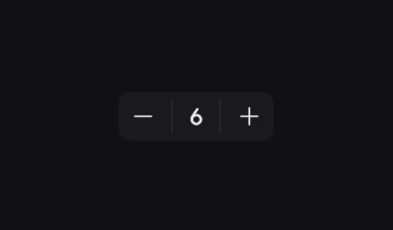

# Stepper

A Stepper is a highly interactive, horizontal layout component used to increase or decrease a numerical value by a constant step. It groups a decrement button, a central label displaying the current value, and an increment button into a single cohesive container.

You can use Steppers for:
- Making small, precise adjustments to a value (e.g., selecting the number of passengers for a flight).
- E-commerce cart management (e.g., adjusting the quantity of an item).
- Fine-tuning system settings that require exact integer inputs.

When not to use Steppers:
- For adjusting values across a massive range where tapping would be tedious (use a `Slider` instead).
- When the user is expected to input a large specific number directly, like a ZIP code or phone number (use a numeric `TextField` instead).

> For deeper reference check out [Mobbin](https://mobbin.com/glossary/stepper) guide on Stepper


## Basic Example 

Because the `Stepper` relies on composable slots rather than rigid data types, you have full control over the buttons and the text. The state must be hoisted and managed by your parent composable.

<figure><figcaption></figcaption></figure>

```kotlin
var quantity by remember { mutableStateOf(1) }

Stepper(
    label = { 
        Text(
            text = quantity.toString(), 
            textStyle = KoreTheme.typography.heading3 
        ) 
    },
    decrementButton = {
        GhostIconButton(
            onClick = { if (quantity > 1) quantity-- },
            enabled = quantity > 1 // Disable when it hits the minimum
        ) {
            Icon(imageVector = PhIcons.Regular.Minus, contentDescription = "Decrease")
        }
    },
    incrementIcon = {
        GhostIconButton(
            onClick = { quantity++ }
        ) {
            Icon(imageVector = PhIcons.Regular.Plus, contentDescription = "Increase")
        }
    }
)
```

## Styling 

The Stepper exposes parameters to handle visual separators, custom sizing, and structural borders, ensuring it can fit into both bordered forms and floating surfaces.

### Parameters

| Parameter | Type | Default | Description |
|-----------|------|---------|-------------|
| `label` | `@Composable () -> Unit` | — | The central content displaying the current value. |
| `decrementButton` | `@Composable () -> Unit` | — | The interactive component on the leading side used to decrease the value. |
| `incrementIcon` | `@Composable () -> Unit` | — | The interactive component on the trailing side used to increase the value. |
| `modifier` | `Modifier` | `Modifier` | Applied to the stepper's outer container. |
| `separator` | `Boolean` | `true` | If true, draws vertical divider lines between the buttons and the central label. |
| `shape` | `Shape` | `StepperDefaults.defaultStepperShape` | The clipping shape of the outer container. |
| `containerColor` | `Color` | `StepperDefaults.defaultContainerColor` | The background color of the stepper container. |
| `border` | `BorderStroke?`| `null` | An optional border drawn around the perimeter of the stepper container. |
| `minLabelWidth` | `Dp` | `StepperDefaults.minimumLabelWidth` | **Crucial:** Allocates a minimum width for the label to prevent the buttons from shifting when text length changes (e.g., from "9" to "10"). |
| `labelPaddingValues` | `PaddingValues`| `StepperDefaults...` | The internal padding immediately surrounding the label content. |
| `separatorPaddingValues`| `PaddingValues`| `StepperDefaults...` | The vertical padding applied to the separators to control their height. |


### Bordered Style without Separators

For a cleaner, more unified look (often used in modern e-commerce apps), you can turn off the internal separators and apply an outer border stroke.

<figure><figcaption></figcaption></figure>

```kotlin
Stepper(
    separator = false, // Removes the internal vertical lines
    border = BorderStroke(1.dp, KoreTheme.colorScheme.outline),
    containerColor = Color.Transparent, // Makes the background hollow
    shape = RoundedCornerShape(8.dp),
    label = { Text("$quantity") },
    decrementButton = { /* ... */ },
    incrementIcon = { /* ... */ }
)
```

### Handling Large Numbers (Width Stabilization)

If your stepper expects large value changes (e.g., going from `0` to `1000`), the text width will grow significantly. You can increase `minLabelWidth` to ensure the plus and minus buttons never jump around visually when the user clicks them.

```kotlin
Stepper(
    minLabelWidth = 64.dp, // Ensures plenty of room for 3 or 4 digit numbers
    label = { Text(largeValue.toString(), textAlign = TextAlign.Center) },
    decrementButton = { /* ... */ },
    incrementIcon = { /* ... */ }
)
```