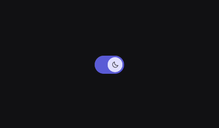

# Switch

A Switch is a visual toggle that allows users to instantly change the state of a single setting between "On" and "Off". It is the digital equivalent of a physical light switch and is used to provide immediate feedback for binary choices.

You can use Switches for:
- Binary settings that take effect immediately (e.g., toggling Wi-Fi, Dark Mode, or Airplane Mode).
- Enabling or disabling specific features within a settings menu.

When not to use Switches:
- When the user must choose one option from a set of many (use RadioButtons).
- When the action requires a "Submit" or "Apply" button to take effect (use a CheckBox).
- For navigation between screens.

---

## Basic Example

Like other input components in KoreLibrary, the Switch is stateless. You must hoist the checked state and update it via the onCheckChange callback.

<figure><figcaption></figcaption></figure>

```kotlin
var isEnabled by remember { mutableStateOf(false) }

Row(
    verticalAlignment = Alignment.CenterVertically,
    modifier = Modifier.fillMaxWidth()
) {
    Text("Enable Push Notifications")
    Spacer(Modifier.weight(1f))
    Switch(
        checked = isEnabled,
        onCheckChange = { isEnabled = it }
    )
}
```

---


## Styling 

The Switch API provides granular control over the sizes of both the track and the thumb, as well as the transition specifications for internal content.

### Parameters

| Parameter | Type | Default | Description |
|-----------|------|---------|-------------|
| checked | Boolean | — | Whether the switch is currently on or off. |
| onCheckChange | ((Boolean) -> Unit)? | — | Callback invoked when the user toggles the switch. |
| modifier | Modifier | Modifier | Applied to the outer track container. |
| enabled | Boolean | true | When false, the switch is greyed out and non-interactive. |
| checkThumbContent | @Composable () -> Unit | null | Optional content to show inside the thumb when checked. |
| unCheckedThumbContent| @Composable () -> Unit | null | Optional content to show inside the thumb when unchecked. |
| switchTrackWidth | Dp | SwitchDefaults.defaultSwitchTrackWidth | The total width of the switch track. |
| switchTrackHeight | Dp | SwitchDefaults.defaultSwitchHeight | The total height of the switch track. |
| thumbSize | Dp | SwitchDefaults.defaultSwitchSize | The diameter/size of the sliding thumb. |
| thumbPadding | Dp | SwitchDefaults.thumbPadding | The inset of the thumb from the track edges. |
| transitionSpec | AnimatedContentTransitionScope | SwitchDefaults.defaultTransitionSpec | Customizes the animation logic for the thumb content. |
| switchColors | SwitchColors | SwitchDefaults.defaultSwitchColors() | Defines track and thumb colors for all states. |

---

## Customization


## Advanced Thumb Content

One of the standout features of the KoreLibrary Switch is the ability to add content inside the thumb that animates when the state changes. This is perfect for adding icons (like a sun/moon or check/cross) to provide extra visual clarity.


<figure><figcaption></figcaption></figure>


```kotlin
Switch(
    checked = isDarkMode,
    onCheckChange = { isDarkMode = it },
    checkThumbContent = {
        Icon(
            imageVector = PhIcons.Regular.Moon, 
            contentDescription = null, 
            modifier = Modifier.size(12.dp)
        )
    },
    unCheckedThumbContent = {
        Icon(
            imageVector = PhIcons.Regular.Sun, 
            contentDescription = null, 
            modifier = Modifier.size(12.dp)
        )
    }
)
```

By default, the switch is pill-shaped, but you can pass custom shapes to the trackShape and thumbShape to match a more industrial or blocky design system.

<figure><figcaption></figcaption></figure>


``` kotlin
Switch(
    checked = checked,
    onCheckChange = { checked = it },
    trackShape = RoundedCornerShape(4.dp),
    thumbShape = RoundedCornerShape(2.dp),
    switchTrackWidth = 60.dp,
    switchTrackHeight = 32.dp,
    thumbSize = 24.dp
)
```

### Micro-Interactions
The Switch includes a built-in thumbScale animation. When the switch is checked, the thumb grows slightly (1.1f) and shrinks slightly when unchecked (0.9f), providing a tactile, "bouncy" feel to the interface.