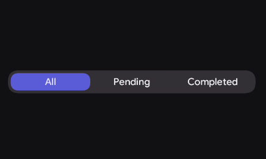
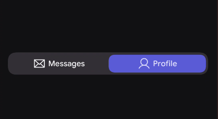
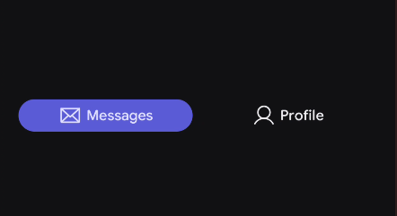

# Tabs

Tabs organize content into high-level categories and allow users to switch between different views within the same context. The KoreLibrary implementation provides a `TabRow` container and individual `Tab` items that feature smooth color animations and automatic content tinting.


---

| Slot | Description |
|---|---|
| `tabs` | The composable slot where you declare your individual `Tab` components. |

## Basic Example

Tabs are stateless. You must manage the `selectedIndex` and update it when a Tab is clicked.

<figure><figcaption></figcaption></figure>


```
var selectedIndex by remember { mutableStateOf(0) }
val categories = listOf("All", "Pending", "Completed")

TabRow(
    selectedIndex = selectedIndex,
    tabs = {
        categories.forEachIndexed { index, title ->
            Tab(
                isSelected = selectedIndex == index,
                onClick = { selectedIndex = index },
                content = { Text(title) }
            )
        }
    }
)
```

---

## With Icons + Data Class

The best practice for managing tabs is to use a stateless data class to pair labels and icons together. The component will handle the vertical spacing between the icon and text automatically.

<figure><figcaption></figcaption></figure>

```
// 1. Define the Tab Data Class
data class TabCategory(
    val title: String,
    val icon: ImageVector
)

// 2. Use it in your UI
@Composable
fun MainScreenTabs() {
    var selectedIndex by remember { mutableStateOf(0) }
    
    // Using PhIcons.Regular for the icons
    val tabCategories = listOf(
        TabCategory("Home", PhIcons.Regular.House),
        TabCategory("Profile", PhIcons.Regular.User)
    )

    TabRow(
        selectedIndex = selectedIndex,
        tabs = {
            tabCategories.forEachIndexed { index, category ->
                Tab(
                    isSelected = selectedIndex == index,
                    onClick = { selectedIndex = index },
                    icon = { 
                        Icon(imageVector = category.icon, contentDescription = null) 
                    },
                    content = { 
                        Text(category.title) 
                    }
                )
            }
        }
    )
}
```

---

## Tab Row (Container)

The `TabRow` is a horizontal container that gives all its children equal width by default. It manages the position and animation of the selection indicator.

### Parameters

| Parameter | Type | Default | Description |
|-----------|------|---------|-------------|
| selectedIndex | Int | — | The index of the currently active tab. |
| modifier | Modifier | Modifier | Applied to the outer container. |
| contentPadding | PaddingValues | TabRowDefaults... | Internal padding for the Tab Row track. |
| tabSpacing | Dp | TabRowDefaults... | Horizontal gap between individual tab items. |
| containerColor | Color | KoreTheme... | Background color of the tab track. |
| indicatorColor | Color | KoreTheme... | Color of the selection highlight. |
| indicator | Composable | TabIndicator | The visual element that moves to show the selection. |
| tabs | Composable | — | The Tab components to be displayed. |

---

## Tab (Item)

The `Tab` is an individual clickable element within a `TabRow`. It handles the layout of icons and labels and animates content colors automatically.

| Slot | Description |
|---|---|
| `content` | The composable slot where you define the main label (usually a `Text` component). |

## Styling 
tab row exposes several params to cusomize the tab row .


### Parameters

| Parameter | Type | Default | Description |
|-----------|------|---------|-------------|
| isSelected | Boolean | — | Controls the visual and interactive active state. |
| onClick | () -> Unit | — | Callback invoked when the tab is pressed. |
| icon | Composable? | null | Optional icon displayed before the content. |
| content | Composable | — | The main label (typically Text). |
| selectedContentColor | Color | KoreTheme... | Color of the icon and text when active. |
| unselectedContentColor| Color | KoreTheme... | Color of the icon and text when inactive. |
| contentPadding | PaddingValues | TabRowDefaults... | Internal spacing for the tab item. |
| iconPadding | PaddingValues | TabRowDefaults... | Spacing specifically around the icon. |

---


### Full-Width "Segments" (Pill Style)
By using `tabSpacing` and fully rounded shapes for the track and indicator, you can create a segmented control look where all segments have equal weight.

<figure><figcaption></figcaption></figure>

```kotlin
TabRow(
    selectedIndex = index,
    tabSpacing = 8.dp, // Adds separation between tabs
    containerColor = Color.Transparent, // Makes the track invisible
    shape = RoundedCornerShape(100), // Pill-shaped track boundary
    indicatorShape = RoundedCornerShape(100), // Pill-shaped indicator highlight
    tabs = { /* Tab items */ }
)
```