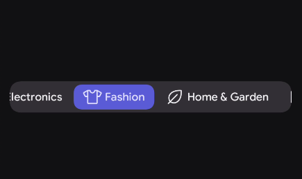

# Scrollable Tab Row

A Scrollable Tab Row is a horizontal container used when the number of tabs exceeds the screen width or when tab labels have varying lengths. Unlike the standard Tab Row, which forces all tabs to have equal width, the Scrollable Tab Row allows each tab to take up only as much space as its content requires.

You can use Scrollable Tab Rows for:
- Interfaces with a large number of categories or filters (e.g., news topics, e-commerce departments, or heavy data tables).
- Tabs with dynamic, varying, or user-generated text lengths where fixed widths would clip the text.
- Deep hierarchical navigation where destinations are numerous and not equally prioritized.

When not to use Scrollable Tab Rows:
- If you have 4 or fewer tabs with short, predictable labels (use the standard `TabRow` to equally distribute them across the screen for a balanced, symmetrical look).
- For primary, top-level app routing at the bottom of the screen (use `NavigationBar` instead).
---

| Slot | Description |
|---|---|
| `tabs` | The composable slot where you declare your individual `Tab` components. |

## Basic Example

Scrollable Tab Rows are ideal for category-heavy interfaces (like an e-commerce app or a news reader). Using a data class is the recommended way to maintain these destinations.

<figure><figcaption></figcaption></figure>

```kotlin
// 1. Define the destination structure
data class Category(
    val title: String,
    val icon: ImageVector
)

@Composable
fun CategoryBrowser() {
    var selectedIndex by remember { mutableStateOf(0) }
    
    val categories = listOf(
        Category("Electronics", PhIcons.Regular.Cpu),
        Category("Fashion", PhIcons.Regular.TShirt),
        Category("Home & Garden", PhIcons.Regular.Leaf),
        Category("Books", PhIcons.Regular.BookOpen),
        Category("Sports", PhIcons.Regular.Basketball)
    )

    ScrollableTabRow(
        selectedIndex = selectedIndex,
        tabs = {
            categories.forEachIndexed { index, item ->
                Tab(
                    isSelected = selectedIndex == index,
                    onClick = { selectedIndex = index },
                    icon = { Icon(item.icon, contentDescription = null) },
                    content = { Text(item.title) }
                )
            }
        }
    )
}
```

---

## Styling

Scrollable tab row exposes several params to cusomize the tab row .

## Parameters

| Parameter | Type | Default | Description |
|-----------|------|---------|-------------|
| selectedIndex | Int | — | The index of the currently active tab. |
| modifier | Modifier | Modifier | Applied to the scrollable container. |
| contentPadding | PaddingValues | TabRowDefaults... | Internal padding for the Tab Row track. |
| tabSpacing | Dp | TabRowDefaults... | The horizontal gap between tabs. |
| shape | Shape | TabRowDefaults... | The shape applied to the entire container. |
| containerColor | Color | KoreTheme... | Background color of the scrollable track. |
| indicatorColor | Color | KoreTheme... | Color of the selection highlight. |
| indicatorShape | Shape | TabRowDefaults... | The shape applied to the moving indicator. |
| indicator | Composable | TabIndicator | The visual element that highlights the selection. |
| tabs | Composable | — | The collection of Tab items to be displayed. |

---


### Custom Indicator
By removing the containerColor and adjusting content color of tab u can create your own inidicator style .


<figure><figcaption></figcaption></figure>

```kotlin
@Composable
fun DotTabIndicator(
    tabPositions: List<TabPosition>,
    selectedIndex: Int,
    modifier: Modifier = Modifier,
    color: Color = KoreTheme.colorScheme.primary,
    dotSize: Dp = 6.dp
) {
    // Fail safely if the positions haven't been calculated yet
    val currentTab = tabPositions.getOrNull(selectedIndex) ?: return
    
    // Calculate the exact horizontal center of the active tab
    val targetX = currentTab.left + (currentTab.width / 2) - (dotSize / 2)
    
    // Animate the offset for a premium sliding effect
    val animatedX by animateDpAsState(
        targetValue = targetX,
        animationSpec = spring(
            dampingRatio = Spring.DampingRatioNoBouncy, 
            stiffness = Spring.StiffnessMediumLow
        ),
        label = "Dot offset"
    )
    
    Box(
        modifier = modifier
            .fillMaxWidth()
            .wrapContentSize(Alignment.BottomStart)
            .offset(x = animatedX, y = (4).dp) // Hover slightly lower the bottom edge
            .size(dotSize)
            .background(color = color, shape = CircleShape)
    )
}
// tab adjustment 
Tab(
    isSelected = selectedIndex == index,
    onClick = { selectedIndex = index },
    selectedContentColor = KoreTheme.colorScheme.primary,
    unselectedContentColor = KoreTheme.colorScheme.onBackGroundVariant,
    icon = { 
        Icon(
            imageVector = item.icon, 
            contentDescription = null
        ) 
    },
    content = { 
        Text(text = item.title) 
    }
)
```

