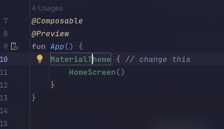
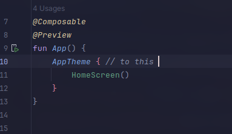

# QuickStart

Quickstart guide for using Kore.

Make sure you have installed the Kore library into your project:

```kotlin
implementation("io.github.dev778g-me:kore:1.0.0-alpha01")
```

Download and install the Kore companion app or web app.

<figure><figcaption></figcaption></figure>

Although Kore comes with default themes `KoreDefaults`, you can customize it using the Kore Companion app **ThemeBuilder**. From there, choose color schemes for dark and light mode, shapes, and sizes — then hit export and you get your `theme.kt` file.

<figure><figcaption></figcaption></figure>

Replace your project's `theme.kt` (which comes by default with Material Theme) or add this file directly to your project.

<figure><figcaption></figcaption></figure>

Wrap your main content with `AppTheme` (renameable inside `theme.kt`) and you're all set.



<figure></figure>


<figure></figure>



*Happy building 😻*