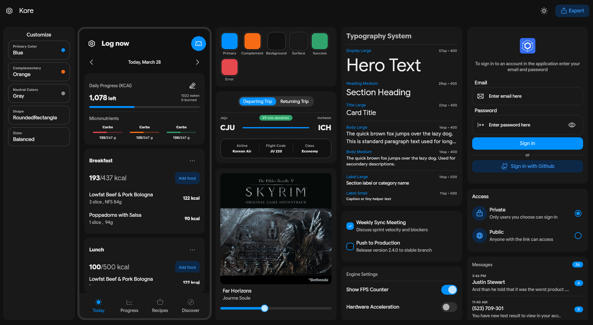
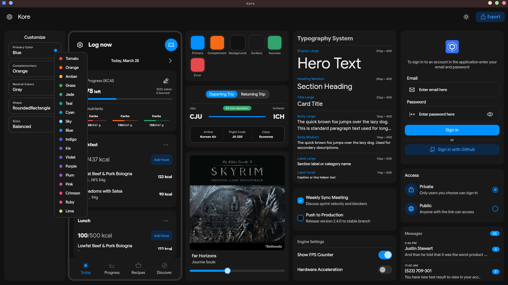
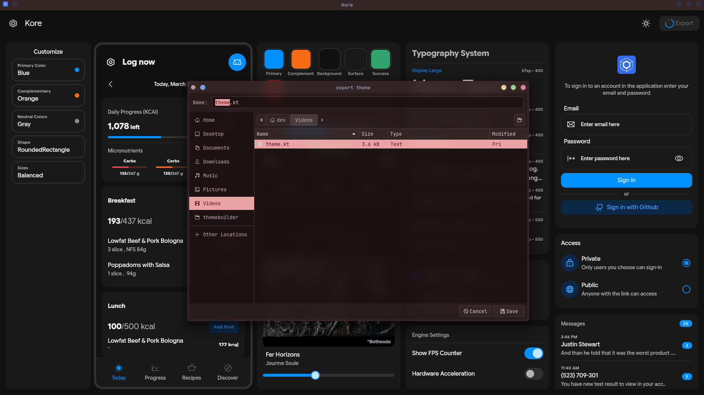

# QuickStart
Quickstart guide for using kore

<p>
Make sure you have installed kore library into your project

```kotlin
implementation("com.dev778g-me:korelibrary:1.0.0 alpha")
```

Download and install the Kore companion app or web app.<br>



Although Kore comes with default themes <a>KoreDefaults</a>, you can customize it with the Kore Companion app <a>ThemeBuilder</a>.<br>
From the companion app you can choose color schemes for both dark and light mode, shapes, and sizes — then hit export and you get your `theme.kt` file.<br>



Replace your project's `theme.kt` file (which comes by default with <a>Material Theme</a>) or add this file to your project.<br>



Wrap your main content with `AppTheme` (you can rename it in `theme.kt`) and you're all set — start building!

<i>Happy building 😻</i>
</p>